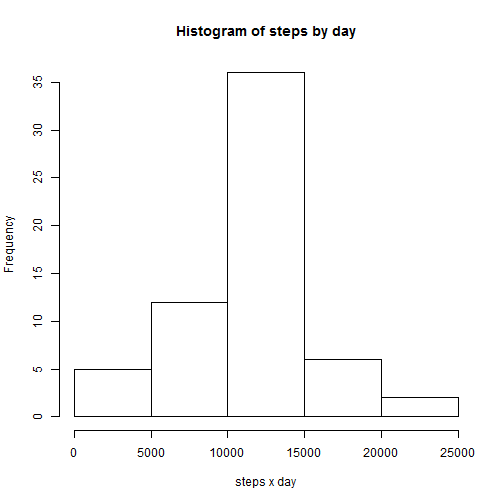
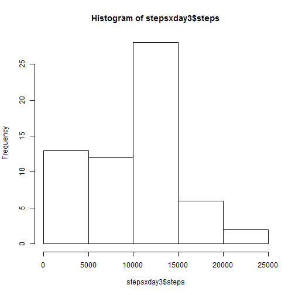

Reproducible Research: Peer Assessment 1
========================================
  
## Loading and preprocessing the data
We're going to load the data and store it in *rawdata* data.frame:

```r
rawdata <- read.csv(unzip("activity.zip"))
```

## What is mean total number of steps taken per day?
For this question we're going to ignore the missing values in the dataset:

```r
data <- na.omit(rawdata)
```

Now, lets see the total number of steps taken each day so we need to aggregate data:

```r
stepsxday <- aggregate(steps ~ date, data, sum)
```

Then print an histogram of the total number of steps taken each day:

```r
hist(stepsxday$steps)
```

 

Let's see how about **mean** and **median** of total numbers of steps taken per day:


```r
mean(stepsxday$steps)
```

```
## [1] 10766
```

```r
median(stepsxday$steps)
```

```
## [1] 10765
```

## What is the average daily activity pattern?
First of all, we're going to aggregate data by steps and interval:


```r
stepsxinterval <- aggregate(steps ~ interval, data, mean)
```

Let's see if there's a pattern with a time series plot:


```r
plot(stepsxinterval, type = "l")
```

 

The maximum steps are reached at 8:35 AM:


```r
maxval <- subset(stepsxinterval, steps == max(stepsxinterval$steps))
maxval$interval
```

```
## [1] 835
```

And the average steps are:


```r
max(stepsxinterval$steps)
```

```
## [1] 206.2
```

## Imputing missing values
Let's take a look on missing values:

```r
mv <- sum(is.na(rawdata$steps))
```

There're 2304 missing values. Let's replace this missing values with the mean of each interval (stored in *stepsxinterval*).


```r
data2 <- rawdata
# loop through rawdata
for (i in 1:nrow(rawdata)) {
    # if is a missing value
    if(is.na(rawdata$steps[i])) {
        # replace it with the mean of this interval
        data2$steps[i] <- subset(stepsxinterval, interval == rawdata$interval[i])$steps
    }
}
```

Let's see an historgram of that new data:

```r
stepsxday2 <- aggregate(steps ~ date, data2, sum)
hist(stepsxday2$steps)
```

 

```r
mean(stepsxday2$steps)
```

```
## [1] 10766
```

```r
median(stepsxday2$steps)
```

```
## [1] 10766
```

## Are there differences in activity patterns between weekdays and weekends?

## BONUS: what is mean total number of steps taken per day (taking NA as 0)?

I reproduce the first question changig NA values as 0. This is done because of some confussing posts in the forum.


```r
data3 <- rawdata
data3[is.na(data3)] <- 0
stepsxday3 <- aggregate(steps ~ date, data3, sum)
hist(stepsxday3$steps)
```

 

```r
mean(stepsxday3$steps)
```

```
## [1] 9354
```

```r
median(stepsxday3$steps)
```

```
## [1] 10395
```
