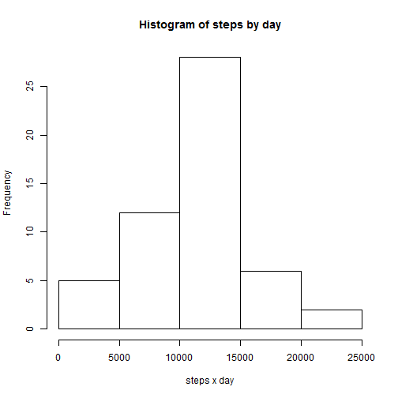

Reproducible Research: Peer Assessment 1
========================================
  
## Loading and preprocessing the data
We're going to load the data and store it in *rawdata* data.frame:

```r
rawdata <- read.csv(unzip("activity.zip"))
```

## What is mean total number of steps taken per day?
For this question we're going to ignore the missing values in the dataset:

```r
data <- na.omit(rawdata)
```

Now, lets see the total number of steps taken each day so we need to aggregate data:

```r
stepsxday <- aggregate(steps ~ date, data, sum)
```

Then print an histogram:

```r
barplot(stepsxday$steps, names.arg=stepsxday$date)
```

 

Lets see how about **mean** and **median** total numbers of steps taken per day:


## What is the average daily activity pattern?


## Imputing missing values


## Are there differences in activity patterns between weekdays and weekends?
